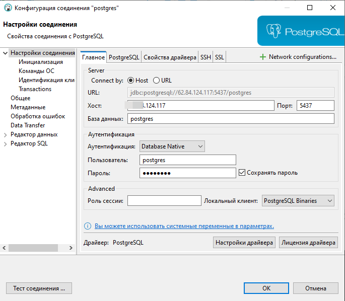
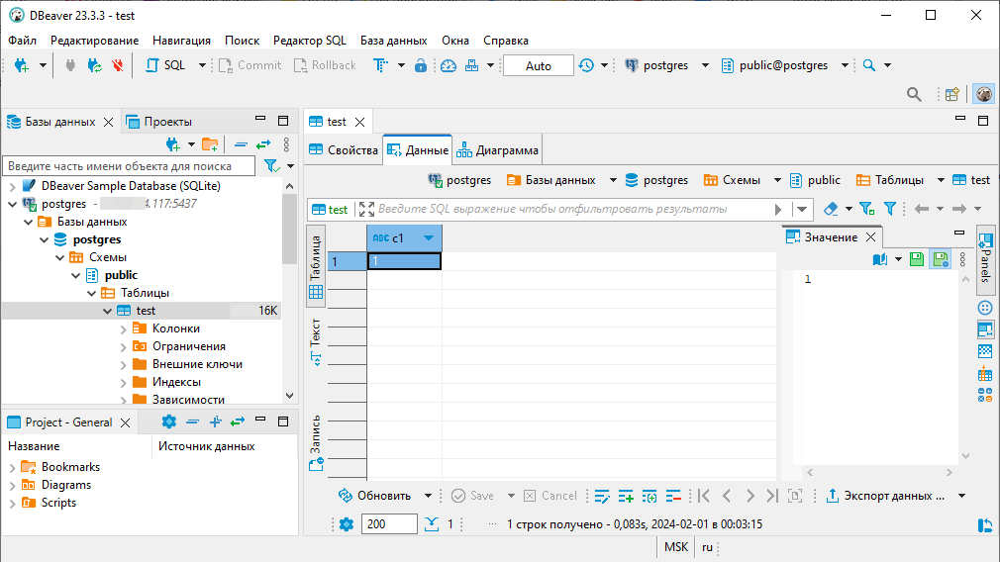

**Домашнее задание Установка и настройка PostgteSQL в контейнере Docker**

Цель: установить PostgreSQL в Docker контейнере настроить контейнер для внешнего подключения
Описание/Пошаговая инструкция выполнения домашнего задания:

# создать ВМ с Ubuntu 20.04/22.04 или развернуть докер любым удобным способом
    Использую ВМ с Ubuntu 22.04.3 LTS в ЯО.

        dima@otus:~$ hostnamectl
                Icon name: computer-vm
                    Chassis: vm
                ...
                Virtualization: kvm
            Operating System: Ubuntu 22.04.3 LTS
                    Kernel: Linux 5.15.0-91-generic
                Architecture: x86-64
            Hardware Vendor: Yandex
            Hardware Model: xeon-gold-6338
 ## Останавка на ВМ сервиса PostgreSQL, чтобы не мешал докеру:
        sudo service postgresql stop

 ## Установа часового пояса Europe/Moscow
        dima@otus:~$ sudo timedatectl set-timezone Europe/Moscow
        dima@otus:~$ ls -l /etc/localtime
        lrwxrwxrwx 1 root root 33 Jan 16 23:36 /etc/localtime -> /usr/share/zoneinfo/Europe/Moscow
        dima@otus:~$ timedatectl
                    Local time: Tue 2024-01-16 23:36:51 MSK
                Universal time: Tue 2024-01-16 20:36:51 UTC
                        RTC time: Tue 2024-01-16 20:36:51
                        Time zone: Europe/Moscow (MSK, +0300)
        System clock synchronized: yes
                    NTP service: active
                RTC in local TZ: no
        dima@otus:~$

 ## Проверка нет ли ранее установленных старых версий докера и удаление, если есть
        dima@otus:~$ sudo apt autoremove docker docker-compose docker
        Reading package lists... Done
        Building dependency tree... Done
        Reading state information... Done
        Package 'docker' is not installed, so not removed
        Package 'docker-compose' is not installed, so not removed
        0 upgraded, 0 newly installed, 0 to remove and 22 not upgraded.

# поставить на нем Docker Engine

  ## Обновление информации о пакетах, имеющихся в системе, и тех, что хранятся в подключенных репозиториях.
        dima@otus:~$ sudo apt-get update
             Для установки докера потребуется дополнительно загрузить пакетs:
            curl — необходим для работы с веб-ресурсами;
            software-properties-common — пакет для управления ПО с помощью скриптов;
            ca-certificates — содержит информацию о центрах сертификации;
            apt-transport-https — необходим для передачи данных по протоколу HTTPS.
            gnupg
            lsb-release
       
   ## Cкачивание пактов, оторые могут понадобится для docker
        dima@otus:~$  sudo apt install curl software-properties-common ca-certificates apt-transport-https -y
        dima@otus:~$  sudo apt install ca-certificates curl gnupg lsb-release
            Reading package lists... Done
            Building dependency tree... Done
            Reading state information... Done
            lsb-release is already the newest version (11.1.0ubuntu4).
            lsb-release set to manually installed.
            ca-certificates is already the newest version (20230311ubuntu0.22.04.1).
            curl is already the newest version (7.81.0-1ubuntu1.15).
            gnupg is already the newest version (2.2.27-3ubuntu2.1).
            gnupg set to manually installed.
            0 upgraded, 0 newly installed, 0 to remove and 29 not upgraded.
   
  ## Импорт GPG-ключей. GPG-ключ нужны для верификации подписей ПО. Может понадобится для добавления репозитория докера в локальный список. 
            wget -O- https://download.docker.com/linux/ubuntu/gpg | gpg --dearmor | sudo tee /etc/apt/keyrings/docker.gpg > /dev/null

            dima@otus:~$ wget -O- https://download.docker.com/linux/ubuntu/gpg | gpg --dearmor | sudo tee /etc/apt/keyrings/docker.gpg > /dev/null
            --2024-01-20 21:58:44--  https://download.docker.com/linux/ubuntu/gpg
            Resolving download.docker.com (download.docker.com)... 65.9.66.72, 65.9.66.46, 65.9.66.54, ...
            Connecting to download.docker.com (download.docker.com)|65.9.66.72|:443... connected.
            HTTP request sent, awaiting response... 200 OK
            Length: 3817 (3.7K) [binary/octet-stream]
            Saving to: ‘STDOUT’
            -                     100%[=======================>]   3.73K  --.-KB/s    in 0s
            2024-01-20 21:58:44 (1.89 GB/s) - written to stdout [3817/3817]

  ## Установка официального APT репозитория docker на Ubuntu:
            curl -fsSL https://download.docker.com/linux/ubuntu/gpg | sudo gpg --dearmor -o /etc/apt/trusted.gpg.d/docker.gpg
            echo "deb [arch=$(dpkg --print-architecture) signed-by=/etc/apt/trusted.gpg.d/docker.gpg] https://download.docker.com/linux/ubuntu $(lsb_release -cs) stable" | sudo tee /etc/apt/sources.list.d/docker.list > /dev/null

  ## Обновление индексов пакетов apt:
            sudo apt update

  ## Установка последнего доступного релиза docker, docker-compose на ВМ
            sudo apt install -y docker-ce docker-ce-cli containerd.io docker-compose docker-compose-plugin
                Reading package lists... Done
                Building dependency tree... Done
                Reading state information... Done
                docker-ce-cli is already the newest version (5:24.0.7-1~ubuntu.22.04~jammy).
                docker-ce is already the newest version (5:24.0.7-1~ubuntu.22.04~jammy).
                docker-compose-plugin is already the newest version (2.21.0-1~ubuntu.22.04~jammy).
                The following additional packages will be installed:
                python3-docker python3-dockerpty python3-docopt python3-dotenv python3-texttable python3-websocket
                Recommended packages:
                docker.io
                The following NEW packages will be installed:
                docker-compose python3-docker python3-dockerpty python3-docopt python3-dotenv python3-texttable python3-websocket
                The following packages will be upgraded:
                containerd.io
                1 upgraded, 7 newly installed, 0 to remove and 28 not upgraded.
                Need to get 29.8 MB of archives.
                After this operation, 3,639 kB of additional disk space will be used.
                Get:1 http://mirror.yandex.ru/ubuntu jammy/universe amd64 python3-websocket all 1.2.3-1 [34.7 kB]
                Get:2 http://mirror.yandex.ru/ubuntu jammy/universe amd64 python3-docker all 5.0.3-1 [89.3 kB]
                Get:3 http://mirror.yandex.ru/ubuntu jammy/universe amd64 python3-dockerpty all 0.4.1-2 [11.1 kB]
                Get:4 http://mirror.yandex.ru/ubuntu jammy/universe amd64 python3-docopt all 0.6.2-4 [26.9 kB]
                Get:5 http://mirror.yandex.ru/ubuntu jammy/universe amd64 python3-dotenv all 0.19.2-1 [20.5 kB]
                Get:6 http://mirror.yandex.ru/ubuntu jammy/universe amd64 python3-texttable all 1.6.4-1 [11.4 kB]
                Get:7 https://download.docker.com/linux/ubuntu jammy/stable amd64 containerd.io amd64 1.6.27-1 [29.5 MB]
                Get:8 http://mirror.yandex.ru/ubuntu jammy/universe amd64 docker-compose all 1.29.2-1 [95.8 kB]
                Fetched 29.8 MB in 1s (30.1 MB/s)
                (Reading database ... 121443 files and directories currently installed.)
                Preparing to unpack .../0-containerd.io_1.6.27-1_amd64.deb ...
                Unpacking containerd.io (1.6.27-1) over (1.6.24-1) ...
                Selecting previously unselected package python3-websocket.
                Preparing to unpack .../1-python3-websocket_1.2.3-1_all.deb ...
                Unpacking python3-websocket (1.2.3-1) ...
                Selecting previously unselected package python3-docker.
                Preparing to unpack .../2-python3-docker_5.0.3-1_all.deb ...
                Unpacking python3-docker (5.0.3-1) ...
                Selecting previously unselected package python3-dockerpty.
                Preparing to unpack .../3-python3-dockerpty_0.4.1-2_all.deb ...
                Unpacking python3-dockerpty (0.4.1-2) ...
                Selecting previously unselected package python3-docopt.
                Preparing to unpack .../4-python3-docopt_0.6.2-4_all.deb ...
                Unpacking python3-docopt (0.6.2-4) ...
                Selecting previously unselected package python3-dotenv.
                Preparing to unpack .../5-python3-dotenv_0.19.2-1_all.deb ...
                Unpacking python3-dotenv (0.19.2-1) ...
                Selecting previously unselected package python3-texttable.
                Preparing to unpack .../6-python3-texttable_1.6.4-1_all.deb ...
                Unpacking python3-texttable (1.6.4-1) ...
                Selecting previously unselected package docker-compose.
                Preparing to unpack .../7-docker-compose_1.29.2-1_all.deb ...
                Unpacking docker-compose (1.29.2-1) ...
                Setting up python3-dotenv (0.19.2-1) ...
                Setting up python3-texttable (1.6.4-1) ...
                Setting up python3-docopt (0.6.2-4) ...
                Setting up containerd.io (1.6.27-1) ...
                Setting up python3-websocket (1.2.3-1) ...
                Setting up python3-dockerpty (0.4.1-2) ...
                Setting up python3-docker (5.0.3-1) ...
                Setting up docker-compose (1.29.2-1) ...
                Processing triggers for man-db (2.10.2-1) ...
                Scanning processes...
                Scanning linux images...

                Running kernel seems to be up-to-date.

                No services need to be restarted.

                No containers need to be restarted.

                No user sessions are running outdated binaries.

                No VM guests are running outdated hypervisor (qemu) binaries on this host.

  ## Добавление пользователя Ubuntu в группу docker, чтобы запускать докер без использования sudo:
            sudo usermod -aG docker $dima
            Список пользователей группы в Linux в файле /etc/group

  ## Перезапуск docker для применния изменений 
            sudo systemctl restart docker

  ## Перезапск Ubuntu (на всякий случай) 
            sudo shutdown -r now

  ## Аутнтификация в docker hub с командной строки Ubuntu
            docker login
            Log in with your Docker ID or email address to push and pull images from Docker Hub. If you don't have a Docker ID, head over to https://hub.docker.com/ to create one.
            You can log in with your password or a Personal Access Token (PAT). Using a limited-scope PAT grants better security and is required for organizations using SSO. Learn more at https://docs.docker.com/go/access-tokens/

            username: your_docker_hub_username
            password: your_password
            WARNING! Your password will be stored unencrypted in /home/dima/.docker/config.json.
            Configure a credential helper to remove this warning. See
            https://docs.docker.com/engine/reference/commandline/login/#credentials-store

            dima@otus:~$ docker pull ubuntu:20.04
            20.04: Pulling from library/ubuntu
            527f5363b98e: Pull complete
            Digest: sha256:f2034e7195f65da85ff50c617732b8
            Status: Downloaded newer image for ubuntu:20.04
            docker.io/library/ubuntu:20.04
            
# сделать каталог /var/lib/postgres
    
    Создал свой каталог /var/lib/postgres/docker

# развернуть контейнер с PostgreSQL 15 смонтировав в него /var/lib/postgresql/docker
    sudo docker run --name pg-server --network pg-net -e POSTGRES_PASSWORD=postgres -d -p 5437:5432 -v /var/lib/postgres/docker:/var/lib/postgresql/data postgres:15

    Подключился к контейнеру с сервером c виртуальной машины через проброшенный порт 5437 и создаю таблицу test, чтобы проверить работу docker
        dima@otus:~$ psql -h localhost -U postgres -p 5437 -d postgres
        Password for user postgres:
        psql (16.1 (Ubuntu 16.1-1.pgdg22.04+1), server 15.4 (Debian 15.4-2.pgdg120+1))
        Type "help" for help.

        postgres=# create table test(c1 text);
        insert into test values('1');
        CREATE TABLE
        INSERT 0 1
        postgres=# exit

    Долго разбирался как войти в запущенный контейнер. В итоге нашел команду docker exec. Вхожу на скрвер через docker и проверяю, то таблица test есть

        dima@otus:~$ docker exec -ti pg-server psql -U postgres -d postgres
        psql (15.4 (Debian 15.4-2.pgdg120+1))
        Type "help" for help.
        postgres=# select * from test;
        c1
        ----
        1
        (1 row)
    
    Удаляю таблицу
        drop table test;

# развернуть контейнер с клиентом postgres
        dima@otus:~$ sudo docker run -it --network pg-net --name pg-client postgres:15 psql -h pg-server -U postgres
        Password for user postgres:
        psql (15.4 (Debian 15.4-2.pgdg120+1))
        Type "help" for help.

        postgres=#
        exit

# подключится из контейнера с клиентом к контейнеру с сервером и сделать таблицу с парой строк
    Подключение          
        dima@otus:~$ docker exec -ti pg-client psql -U postgres -h pg-server -p 5432
        Password for user postgres:
        psql (15.4 (Debian 15.4-2.pgdg120+1))
        Type "help" for help.

    Создание таблицы
        postgres=# create table test(c1 text);
        insert into test values('1');
        CREATE TABLE
        INSERT 0 1
        postgres=# exit

        postgres=# select * from test;
        c1
        ----
        1
        (1 row)

        postgres=#

# подключится к контейнеру с сервером с ноутбука/компьютера извне инстансов GCP/ЯО/места установки докера
Подключился к Postgres, находящемся в контейнере Docker на ВМ в ЯО с Dbeaver на ноутбуке, используя порт 5437 на ВМ.

# удалить контейнер с сервером
    Попытка сразу удалить    
        dima@otus:~$ docker rm pg-server
        Error response from daemon: cannot remove container "/pg-server": container is running: stop the container before removing or force remove
    Остановка контейнера с сервером
        dima@otus:~$ docker stop pg-server
        pg-server
    Удаление
        dima@otus:~$ docker rm pg-server
        pg-server
    Проверка что онтейнер с сервером удален
        dima@otus:~$ sudo docker ps -a
        CONTAINER ID   IMAGE          COMMAND                  CREATED          STATUS                   PORTS      NAMES
        7607f92a6eee   postgres:15    "docker-entrypoint.s…"   48 minutes ago   Up 47 minutes            5432/tcp   pg-client
        dima@otus:~$

# создать его заново

        dima@otus:~$ sudo docker run --name pg-server --network pg-net -e POSTGRES_PASSWORD=postgres -d -p 5437:5432 -v /var/lib/postgres/docker:/var/lib/postgresql/data postgres:15
        6f81e9bb355f8b5564b87e377e111d3524e359542b4ca674a773cfef634c59cc
        dima@otus:~$ sudo docker ps -a
        CONTAINER ID   IMAGE          COMMAND                  CREATED          STATUS                   PORTS                                       NAMES
        6f81e9bb355f   postgres:15    "docker-entrypoint.s…"   5 seconds ago    Up 4 seconds             0.0.0.0:5437->5432/tcp, :::5437->5432/tcp   pg-server
        7607f92a6eee   postgres:15    "docker-entrypoint.s…"   49 minutes ago   Up 48 minutes            5432/tcp                                    pg-client

# подключится снова из контейнера с клиентом к контейнеру с сервером
        dima@otus:~$ docker exec -ti pg-client psql -U postgres -h pg-server -p 5432
        Password for user postgres:
        psql (15.4 (Debian 15.4-2.pgdg120+1))
        Type "help" for help.

        postgres=# 

# проверить, что данные остались на месте
        postgres=# select * from test;
        c1
        ----
        1
        (1 row)

# оставляйте в ЛК ДЗ комментарии что и как вы делали и как боролись с проблемами

Критерии оценки:
Выполнение ДЗ: 10 баллов
плюс 2 балла за красивое решение
минус 2 балла за рабочее решение, и недостатки указанные преподавателем не устранены