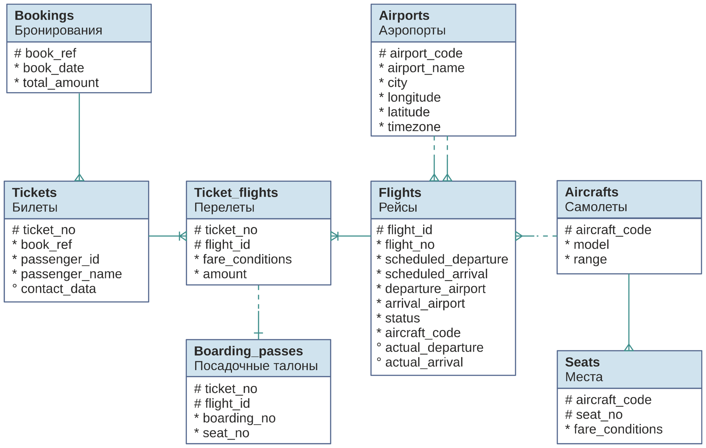

** ДЗ №19. Статистика.

# Цель
- знать и уметь применять различные виды join'ов
- строить и анализировать план выполнения запроса
- оптимизировать запрос
- уметь собирать и анализировать статистику для таблицы

# Описание/Пошаговая инструкция выполнения домашнего задания:
В результате выполнения ДЗ вы научитесь пользоваться
различными вариантами соединения таблиц.
В данном задании тренируются навыки:
написания запросов с различными типами соединений
Необходимо:

ДЗ Выполняю на БД demo (big), схема bookings от PostgresPro.ru. БД загружена на ВМ в ЯО.

# Реализовать прямое соединение двух или более таблиц
    Запрос:
        -- Плучение данных пассажиров по номеру бронирования.
        select b.book_ref, t.passenger_name, f.flight_no, a.model 
        from bookings b                             
        join tickets t on b.book_ref = t.book_ref 
        join ticket_flights tf on tf.ticket_no = t.ticket_no 
        join flights f on f.flight_id = tf.flight_id 
        join aircrafts a on f.aircraft_code = a.aircraft_code 
        where b.book_ref = '000048';
    Результат:
        |book_ref|passenger_name  |flight_no|model            |
        |--------|----------------|---------|-----------------|
        |000048  |SVETLANA IVANOVA|PG0368   |Бомбардье CRJ-200|
        |000048  |SVETLANA IVANOVA|PG0369   |Бомбардье CRJ-200|
        |000048  |YURIY KUZNECOV  |PG0368   |Бомбардье CRJ-200|
        |000048  |YURIY KUZNECOV  |PG0369   |Бомбардье CRJ-200|

# Реализовать левостороннее (или правостороннее) соединение двух или более таблиц
      Запрос:
        -- Получить по самолету 'Аэробус A320-200' в какие аэропорты он летает 
        select distinct a.model, f.flight_no, a2.airport_name  from aircrafts a  -- выбираем самолет, используем 
        left join flights f on f.aircraft_code = a.aircraft_code    -- добавляем рейсы в которых принимает участие самолет
        left join airports a2 on a2.airport_code = f.arrival_airport  -- добавляем аэропорты из которых самолет вылетал
        left join airports a3 on a3.airport_code = f.departure_airport  -- добавляем аэропорты в которые самолет прилетал
        where a.model = 'Аэробус A320-200';
        
      Результат:
        |model           |flight_no|airport_name|
        |----------------|---------|------------|
        |Аэробус A320-200|[NULL]   |[NULL]      |
       
        Самолет Аэробус A320-200 никуда не летает

# Реализовать кросс соединение двух или более таблиц
    Составим таблицу расстояний между всеми аэропортами в милях
    Включим расширения для работы с расстояниями между географическими точками:
        create extension cube;
        create extension earthdistance;
    Составим кросс таблицу аэропортов друг с другом и посчитаем рассточние
        select  (a1.coordinates<@>a2.coordinates) as range, a1.airport_name, a2.airport_name
        from airports a1
        cross join airports a2;  -- Связь таблицы с самой собой
    Результат:
        |range           |airport_name|airport_name    |
        |----------------|------------|----------------|
        |0               |Якутск      |Якутск          |
        |504,6982136016  |Якутск      |Мирный          |
        |960,3543878542  |Якутск      |Хабаровск-Новый |
        |1 212,4864355056|Якутск      |Елизово         |
        |1 166,9906631394|Якутск      |Хомутово        |
        |1 295,2579251408|Якутск      |Владивосток     |
        |3 008,3945538471|Якутск      |Пулково         |
        |3 497,357703689 |Якутск      |Храброво        |
        |1 602,6624560236|Якутск      |Кемерово        |
        |2 375,9912968959|Якутск      |Челябинск       |
        |2 546,2036698267|Якутск      |Магнитогорск    |
        |2 424,1403426461|Якутск      |Пермь           |
        |1 787,5451745048|Якутск      |Сургут          |
        |3 255,898540379 |Якутск      |Брянск          |
        |3 490,9389547007|Якутск      |Минеральные Воды|
        ...

# Реализовать полное соединение двух или более таблиц
  Запрос:
    -- Проверка заполнения рейса PG0342 от 2017-08-15 с проверкой нет ли билетов на несуществующие места
     select 
      	s1.seat_no as a_seat_no,        -- Номер места в самолете
 		    s2.seat_no as t_seat_no,        -- номер места в посадочном талоне
 		    s2.passenger_name  -- Имя пассажира
     from 
     -- подзапрос на существующие места на рейсе PG0342 от 2017-08-15
     (select * from flights f 
 	      join aircrafts a on a.aircraft_code  = f.aircraft_code 
 	      join seats s on s.aircraft_code = f.aircraft_code 
 	      where 
 	      f.flight_no = 'PG0342'  -- номер рейса
 	       -- ограничение рейса по дате, чтобы выбрать один рейс
         and f.scheduled_departure >= '2017-08-15'::date and f.scheduled_departure < '2017-08-16'::date 
 	 ) as s1
     full outer join 
     --подзапрос на существующие места на рейс PG0342 от 2017-08-15
     (    select * from flights f 
       join ticket_flights tf on tf.flight_id  = f.flight_id 
       join boarding_passes bp on bp.flight_id = tf.flight_id and bp.ticket_no = tf.ticket_no  
       join tickets t on t.ticket_no =tf.ticket_no 
    	 where 
 	   f.flight_no = 'PG0342'
       and f.scheduled_departure >= '2017-08-15'::date and f.scheduled_departure < '2017-08-16'::date
     ) as s2
     on s1.seat_no = s2.seat_no			 -- связка по номеру места
     order by lpad(s1.seat_no, 3, '0')   -- сортировка по номерам мест
  Результат:

      |a_seat_no|t_seat_no|passenger_name     |
      |---------|---------|-------------------|
      |1A       |1A       |SERGEY KRASNOV     |
      |1B       |         |                   |
      |1C       |         |                   |
      |1D       |         |                   |
      |2A       |         |                   |
      |2B       |2B       |RAISA ANDREEVA     |
      |2C       |2C       |ANNA ZHUKOVA       |
      |2D       |         |                   |
      |3A       |         |                   |
      |3B       |         |                   |
      |3C       |3C       |TATYANA SAVELEVA   |
      |3D       |         |                   |
      |4A       |         |                   |
      |4B       |4B       |SVETLANA VOROBEVA  |
      |4C       |         |                   |
      |4D       |4D       |TATYANA ARKHIPOVA  |
      |5A       |         |                   |
      |5B       |         |                   |
      |5C       |         |                   |
      |5D       |         |                   |
      |6A       |         |                   |
      |6B       |         |                   |
      |6C       |         |                   |
      |6D       |         |                   |
      |7A       |         |                   |
      |7B       |7B       |VLADIMIR SCHERBAKOV|
      |7C       |         |                   |
      |7D       |         |                   |
      |18A      |         |                   |
      |18B      |18B      |SERGEY NAZAROV     |
      |18C      |         |                   |
      |18D      |         |                   |
      |19A      |         |                   |
      |19B      |         |                   |
      |19C      |         |                   |
      |19D      |         |                   |
      |20A      |         |                   |
      |20B      |         |                   |
      |20C      |         |                   |
      |20D      |         |                   |
      |21A      |         |                   |
      |21B      |21B      |DMITRIY SHEVCHENKO |
      |21C      |         |                   |
      |21D      |21D      |ALEVTINA ILINA     |
      |22A      |         |                   |
      |22B      |         |                   |
      |22C      |22C      |DMITRIY FILIPPOV   |
      |22D      |         |                   |
      |23A      |         |                   |
      |23B      |         |                   |

    Есть места с некупленными билетами, но билетов на несуществующие места не нашлось.
   
# Реализовать запрос, в котором будут использованы разные типы соединений

    Запрос:
       -- Получить список билетов и посадочных талонов c местмаи, выданных на рейс PG0118 от 2017-08-15
        select 
        t.passenger_name,
        tf.ticket_no,
        tf.fare_conditions,
        bp.boarding_no,
        bp.seat_no
        from flights f 
        join ticket_flights tf on f.flight_id = tf.flight_id 
        join tickets t on tf.ticket_no = t.ticket_no 
        left join boarding_passes bp on bp.ticket_no = tf.ticket_no  and bp.flight_id = tf.flight_id 
        where 
        -- ограничение по рейсу
        f.flight_no = 'PG0118'
        -- ограничение по дате
        and f.scheduled_departure >= '2017-08-15'::date and f.scheduled_departure < '2017-08-16'::date 
        -- отсортировать по классу места
        order by tf.fare_conditions 
    Результат:
        |passenger_name       |ticket_no    |fare_conditions|boarding_no|seat_no|
        |---------------------|-------------|---------------|-----------|-------|
        |MARINA VOROBEVA      |0005432905157|Business       |7          |3A     |
        |OLEG PETROV          |0005432287259|Business       |13         |3C     |
        |NIKOLAY PAVLOV       |0005432329337|Business       |6          |1C     |
        |NIKOLAY GAVRILOV     |0005432329315|Business       |           |       |
        |NIKOLAY ZAKHAROV     |0005432329320|Business       |           |       |
        |ANASTASIYA GAVRILOVA |0005432287260|Business       |           |       |
        |SHAVKAT NIKOLAEV     |0005432329322|Business       |10         |3D     |
        |ZINAIDA KOROLEVA     |0005432329313|Business       |           |       |
        |IRINA OSIPOVA        |0005433438972|Business       |           |       |
        |DENIS IVANOV         |0005432329305|Economy        |           |       |
        |DMITRIY ISAEV        |0005432329306|Economy        |           |       |
        |ILYA KOZLOV          |0005432329307|Economy        |8          |9A     |
        |TAMARA MIRONOVA      |0005432329308|Economy        |           |       |
        |VALERIY SOROKIN      |0005432329309|Economy        |           |       |
        |OKSANA RYABOVA       |0005432329310|Economy        |           |       |
        |DANIIL ILIN          |0005432329311|Economy        |           |       |
        |ANTON ORLOV          |0005432329312|Economy        |           |       |
        |SERGEY MAKAROV       |0005432329314|Economy        |           |       |
        |DENIS ZAKHAROV       |0005432329316|Economy        |           |       |
        |KSENIYA KARPOVA      |0005432329317|Economy        |           |       |
        |ANASTASIYA IVANOVA   |0005432329318|Economy        |           |       |
        |SVETLANA ZAKHAROVA   |0005432329319|Economy        |14         |8A     |
        |ANNA KAZAKOVA        |0005432329321|Economy        |           |       |
        |NATALYA MALYSHEVA    |0005432329323|Economy        |9          |17F    |
        |ALEKSANDR ALEKSANDROV|0005432329324|Economy        |5          |8D     |
        |TATYANA RYABOVA      |0005432329325|Economy        |           |       |
        |VLADIMIR MOISEEV     |0005432329326|Economy        |           |       |
        |LYUBOV KOLESNIKOVA   |0005432329327|Economy        |4          |4C     |
        |OLGA GRISHINA        |0005432329328|Economy        |           |       |
        |NATALYA PETROVA      |0005432329329|Economy        |           |       |
        |SERGEY VOROBEV       |0005432329330|Economy        |           |       |
        |VALENTINA GERASIMOVA |0005432329331|Economy        |1          |15E    |
        |LIDIYA KOLESNIKOVA   |0005432329332|Economy        |           |       |
        |ALEKSANDR ALEKSANDROV|0005432329333|Economy        |           |       |
        |EVGENIYA VASILEVA    |0005432287256|Economy        |           |       |
        |MARIYA SAVELEVA      |0005432329335|Economy        |           |       |
        |IGOR FOMIN           |0005432329336|Economy        |           |       |
        |NIKOLAY MAKAROV      |0005432329338|Economy        |15         |19A    |
        |MARIYA KONDRATEVA    |0005432329339|Economy        |           |       |
        |NADEZHDA BOGDANOVA   |0005432329340|Economy        |           |       |
        |YULIYA DANILOVA      |0005432329341|Economy        |           |       |
        |MIKHAIL ALEKSANDROV  |0005432329342|Economy        |           |       |
        |ELIZAVETA SEMENOVA   |0005432329343|Economy        |           |       |
        |VALENTINA LOGINOVA   |0005432329344|Economy        |12         |14E    |
        |DMITRIY FOMIN        |0005432329345|Economy        |           |       |
        |IGOR DENISOV         |0005432329346|Economy        |           |       |
        |ELENA POTAPOVA       |0005432905135|Economy        |           |       |
        |VALENTINA POPOVA     |0005432905136|Economy        |           |       |
        |KONSTANTIN ZAKHAROV  |0005432905152|Economy        |           |       |
        |LYUDMILA SOROKINA    |0005432905158|Economy        |           |       |
        |SERGEY ZHURAVLEV     |0005432905165|Economy        |           |       |
        |ALEKSEY DENISOV      |0005432905166|Economy        |3          |10F    |
        |DMITRIY DMITRIEV     |0005432905167|Economy        |11         |6E     |
        |DENIS FROLOV         |0005432905168|Economy        |           |       |
        |IVAN OSIPOV          |0005432905172|Economy        |           |       |
        |IGOR MATVEEV         |0005433438971|Economy        |           |       |
        |IVAN IVANOV          |0005432329334|Economy        |           |       |
        |OLGA FILATOVA        |0005432287257|Economy        |           |       |
        |VLADIMIR POPOV       |0005432287258|Economy        |           |       |
        |NINA BORISOVA        |0005432329299|Economy        |           |       |
        |NADEZHDA ZHURAVLEVA  |0005432329300|Economy        |2          |4A     |
        |ANTONINA KOROLEVA    |0005432329301|Economy        |           |       |
        |KSENIYA POPOVA       |0005432329302|Economy        |           |       |
        |VALENTINA NESTEROVA  |0005432329303|Economy        |           |       |
        |EVGENIY KUZMIN       |0005432329304|Economy        |           |       |

# Сделать комментарии на каждый запрос
        Комментарии сделаны по тексту

# К работе приложить структуру таблиц, для которых выполнялись соединения

Задание со звездочкой*
Придумайте 3 своих метрики на основе показанных представлений, отправьте их через ЛК, а так же поделитесь с коллегами в слаке
---