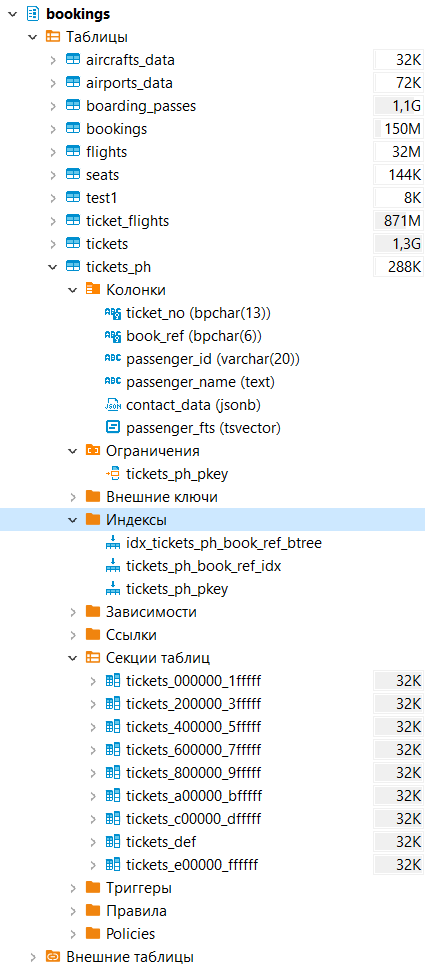
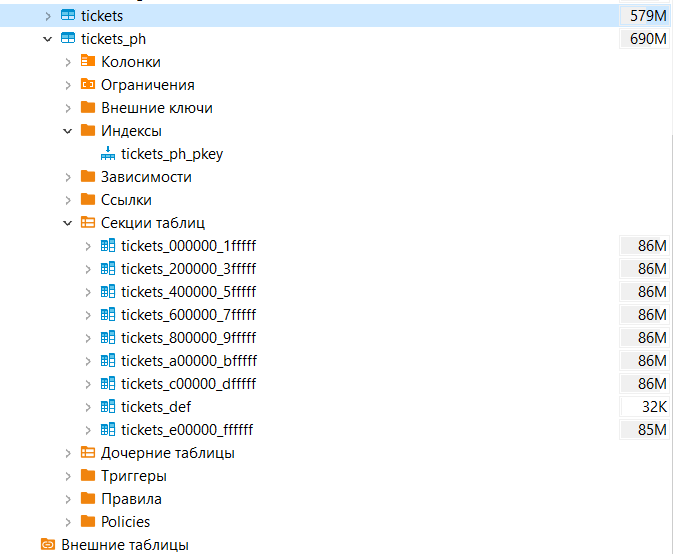

Описание/Пошаговая инструкция выполнения домашнего задания:
Секционировать большую таблицу из демо базы flights

# -- Описание решения
      ДЗ выполняю на БД demo, схема bookings от postgrespro.ru. Взята БД размером big.
      Секционирую таблицу tickets (билеты) с именами пассажиров. Таблица размером 1,3Гб (наибольшая таблица).
      Таблица имеет:
      - первичный ключ ticket_no bpchar(13) not null,
      - внешний ключ tickets_book_ref_fkey по полю book_ref.

      Секционировать буду по полю book_ref (номер бронирования) так, чтобы билеты из одного бронирования не попали в разные секции. book_ref является уникальным идентификатором в таблице bookings, поэтому думаю можно его взять за основу для секционирования таблицы tickets.

      Для увеличения производительности предполагаю секционировать таблицу tickets по диапазону значений поля book_ref. Все текущие брони окажутся восновном в одной или нескольких рядом лежащих секциях. Возможно запросы по текущему рейсу могут выполняться быстрее если все бронирования попадут в в одну секцию.

 ## -- Статистика по таблицам

      /* Предполагаемые диапазоны секционирования по значению поля book_ref: 
      000000 - 1FFFFF - 368 685 билетов
      200000 - 3FFFFF - 367 809 билетов
      400000 - 5FFFFF - 370 170 билетов
      600000 - 7FFFFF - 368 285 билетов
      800000 - 9FFFFF - 368 771 билетов
      A00000 - BFFFFF - 369 577 билетов
      C00000 - DFFFFF - 368 982 билетов
      E00000 - FFFFFF - 367 578 билетов
      1000000 - 10FFFFF -   0  билетов
      Итого:  		  2949857 - всего записей (билетов) в tickets
      Билеты равномерно распределены по бронированиям в таблице tickets 

      2111110 - всего бронирований в bookings
      2111110 - всего уникальных book_ref в tickets
      Т.е. ошибок в связях таблиц нет.
      */

      select min(book_ref) from bookings b;
      -- 000004 - первый использованный номер бронирования

      select max(book_ref) from bookings b
      -- FFFFF9 - последний использованный номер бронирования

# -- Создание функции для преобразования строк с шестнадцтиричными числами в целые числа. Чтобы конвертировать номер регистрации book_ref из bpchar(6) в bigint.
      CREATE OR REPLACE FUNCTION hex_to_bigint(hexval varchar) RETURNS bigint AS $$
      DECLARE
         result  bigint;
      BEGIN
      EXECUTE 'SELECT x''' || hexval || '''::bigint' INTO result;
      RETURN result;
      END;
      $$
      LANGUAGE 'plpgsql' IMMUTABLE STRICT;

# -- Разделение таблицы tickets

 ## -- Создание партицированной таблицы путем копирования свойств существующей таблицы с их частичным изменением через временную таблицу:
   begin;
   create table tickets_ph2 (like tickets including all);
   alter table tickets_ph2
      -- добавьте следующие 2 строки для каждого другого уникального ограничения (кроме первичного ключа) в исходной таблице:
      drop constraint tickets_ph2_pkey,       -- удаление ограничения первиченого ключа tickets_ph2_{column}_key,
      add primary key (ticket_no, book_ref);  -- добавление ограничения первичного ключа и ключа секционирования ({column}, {поле секционирования}),
   create table tickets_ph (like tickets_ph2 including all)
      partition by range (book_ref);
   drop table tickets_ph2;
   commit;

 ## -- Альтернативный вариант. Создание партицированной таблицы аналогично tickets путем указания в все свойств.
      create table bookings.tickets_ph (
         ticket_no bpchar(13) NOT NULL,
         book_ref bpchar(6) NOT NULL,
         passenger_id varchar(20) NOT NULL,
         passenger_name text NOT NULL,
         contact_data jsonb NULL,
         passenger_fts tsvector NULL,
         -- Первичный ключ только по ticket_no не может гарантировать уникальность на разных партициях, 
         -- поэтому добавляем в первичный ключ ключ секционирования - ticket_no.
         CONSTRAINT tickets_ph_pkey PRIMARY KEY (book_ref, ticket_no),
         CONSTRAINT tickets_ph_book_ref_fkey FOREIGN KEY (book_ref) REFERENCES bookings.bookings(book_ref)
      ) partition by range (book_ref);

      -- drop table tickets_ph;

# -- Первичный ключь новой таблицы привязывается к tickets.
      ALTER TABLE ONLY bookings.tickets_ph ALTER COLUMN ticket_no SET DEFAULT nextval('tickets'::regclass);

# -- Добавление индекса по полю book_ref как в tickets
      create index idx_tickets_ph_book_ref_btree on tickets_ph using btree (book_ref);
      -- drop index idx_tickets_ph_book_ref_btree;

# -- Создание дефлотной партиции
      CREATE TABLE bookings.tickets_def PARTITION OF bookings.tickets_ph DEFAULT;
      -- drop table bookings.tickets_def; 
      -- Создание 8 партиций. Одна под новые данные. 
      create table tickets_000000_1FFFFF partition of tickets_ph for values from ('000000') to ('1FFFFF');
      create table tickets_200000_3FFFFF partition of tickets_ph for values from ('200000') to ('3FFFFF');
      create table tickets_400000_5FFFFF partition of tickets_ph for values from ('400000') to ('5FFFFF');
      create table tickets_600000_7FFFFF partition of tickets_ph for values from ('600000') to ('7FFFFF');
      create table tickets_800000_9FFFFF partition of tickets_ph for values from ('800000') to ('9FFFFF');
      create table tickets_A00000_BFFFFF partition of tickets_ph for values from ('A00000') to ('BFFFFF');
      create table tickets_C00000_DFFFFF partition of tickets_ph for values from ('C00000') to ('DFFFFF');
      create table tickets_E00000_FFFFFF partition of tickets_ph for values from ('E00000') to ('FFFFFF');
      -- drop table tickets_E00000_FFFFFF;
   
# -- Создание функции для обновления новой таблицы tickets. Каждый раз, когда будет происходить запись или изменение в старой таблице tickets, будут добавляться и обновляться данные и в новой таблице tickets_ph.
      CREATE OR REPLACE FUNCTION tickets_mirror_f ()
      RETURNS TRIGGER   AS $body$ 
         BEGIN   
            IF TG_OP = 'INSERT' 
               THEN     INSERT INTO tickets_ph
               SELECT       NEW.*;
               RETURN NEW;
            ELSIF TG_OP = 'UPDATE' 
               THEN     UPDATE       tickets_ph     
               SET      tickets_no = NEW.tickets_no,
                     book_ref = NEW.book_ref,
                     passenger_id = NEW.passenger_id,
                     passenger_name = NEW.passenger_name,
                     contact_data = NEW.contact_data,
                     passenger_fts = NEW.passenger_fts
                  WHERE       tickets_no = OLD.tickets_no;
               RETURN NEW;
            END IF; 
         END; $body$ 
      LANGUAGE 'plpgsql';
      -- drop function tickets_mirror_f;

# -- Создание триггера на обновления старой таблицы tickets
      CREATE TRIGGER trigger_tickets AFTER INSERT OR UPDATE ON tickets FOR EACH ROW EXECUTE PROCEDURE tickets_mirror_f ();
      -- drop trigger trigger_tickets on tickets;

# -- Копирование данных из старой таблицы в секционированную
      insert into bookings.tickets_ph select * from bookings.tickets on conflict do nothing;
   

# -- Создание функции для переноса архивных данных из таблицы ticketsh в tickets_ph
      CREATE OR REPLACE PROCEDURE procedure_tickets_sync () AS 
      $body$ 
      DECLARE current_ticket_no bigint DEFAULT 0; 
            flag BOOLEAN DEFAULT TRUE; 
         BEGIN WHILE flag 
            LOOP 
               INSERT INTO tickets_ph 
                  SELECT * 
                  FROM tickets AS temp 
                  WHERE hex_to_bigint(temp.ticket_no) > current_ticket_no 
                  ORDER BY hex_to_bigint(temp.ticket_no) LIMIT 1 
               FOR UPDATE ON CONFLICT DO NOTHING RETURNING hex_to_bigint(ticket_no) INTO current_ticket_no; 
               IF current_ticket_no IS NULL 
                  THEN flag := FALSE; 
               END IF; 
            END LOOP;
         RETURN; 
         END;
      $body$ 
      LANGUAGE 'plpgsql';
      -- drop procedure current_ticket_no;
      CALL procedure_tickets_sync();

# -- План запроса по не секционированной таблице
      Запрос
         explain analyze   
         select * 
         from tickets t 
         where t.book_ref < '450000';
      Результат
         Bitmap Heap Scan on tickets t  (cost=8499.81..81387.93 rows=806010 width=140) (actual time=106.072..284.267 rows=794505 loops=1)
         Recheck Cond: (book_ref < '450000'::bpchar)
         Heap Blocks: exact=62809
         ->  Bitmap Index Scan on idx_tickets_book_ref_btree  (cost=0.00..8298.31 rows=806010 width=0) (actual time=93.312..93.313 rows=794505 loops=1)
               Index Cond: (book_ref < '450000'::bpchar)
         Planning Time: 0.225 ms
         Execution Time: 308.480 ms

# -- План запроса по секционированной таблице
      Запрос
         explain analyze   
         select * 
         from tickets_ph t 
         where t.book_ref < '450000';
      Результат
         Append  (cost=0.00..40298.58 rows=795653 width=140) (actual time=0.014..242.613 rows=794505 loops=1)
         ->  Seq Scan on tickets_000000_1fffff t_1  (cost=0.00..12461.56 rows=368648 width=140) (actual time=0.013..70.382 rows=368685 loops=1)
               Filter: (book_ref < '450000'::bpchar)
         ->  Seq Scan on tickets_200000_3fffff t_2  (cost=0.00..12431.61 rows=367772 width=140) (actual time=0.028..72.052 rows=367809 loops=1)
               Filter: (book_ref < '450000'::bpchar)
         ->  Index Scan using tickets_400000_5fffff_pkey on tickets_400000_5fffff t_3  (cost=0.42..11425.77 rows=59223 width=140) (actual time=0.041..54.647 rows=58011 loops=1)
               Index Cond: (book_ref < '450000'::bpchar)
         ->  Seq Scan on tickets_def t_4  (cost=0.00..1.38 rows=10 width=238) (actual time=0.016..0.016 rows=0 loops=1)
               Filter: (book_ref < '450000'::bpchar)
               Rows Removed by Filter: 1
         Planning Time: 0.147 ms
         Execution Time: 266.886 ms

 -- Видно что при запросе по tickets_ph идет поиск по части секций. Секции задействуются

# -- Переключение на секционированную таблицу tickets в tickets_ph
      begin;
      set statement_timeout to '1s';
      alter table tickets rename to tickets_archive;
      alter table tickets_ph rename to tickets;
      commit;

# -- Проверка работы связей и секций
   Запрос

      explain analyze   
      select *
      from tickets t 
      join bookings b on b.book_ref = t.book_ref
      where t.book_ref between '3FFFFD' and '400009';

   План запроса

      Nested Loop  (cost=0.85..14403.66 rows=3 width=193) (actual time=50.323..2510.749 rows=2 loops=1)
      ->  Append  (cost=0.42..14395.72 rows=3 width=173) (actual time=45.296..2505.685 rows=2 loops=1)
            ->  Index Scan using tickets_200000_3fffff_pkey on tickets_200000_3fffff t_1  (cost=0.42..7184.22 rows=1 width=140) (actual time=45.294..729.099 rows=1 loops=1)
                  Index Cond: ((book_ref >= '3FFFFD'::bpchar) AND (book_ref <= '400009'::bpchar))
            ->  Index Scan using tickets_400000_5fffff_pkey on tickets_400000_5fffff t_2  (cost=0.42..7210.03 rows=1 width=140) (actual time=98.191..1774.835 rows=1 loops=1)
                  Index Cond: ((book_ref >= '3FFFFD'::bpchar) AND (book_ref <= '400009'::bpchar))
            ->  Seq Scan on tickets_def t_3  (cost=0.00..1.45 rows=1 width=238) (actual time=1.739..1.739 rows=0 loops=1)
                  Filter: ((book_ref >= '3FFFFD'::bpchar) AND (book_ref <= '400009'::bpchar))
                  Rows Removed by Filter: 1
      ->  Index Scan using bookings_pkey on bookings b  (cost=0.43..2.65 rows=1 width=21) (actual time=2.514..2.514 rows=1 loops=2)
            Index Cond: (book_ref = t.book_ref)
      Planning Time: 10.407 ms
      Execution Time: 2510.804 ms
   
   Результат
   
      |ticket_no    |book_ref|passenger_id|passenger_name    |contact_data                                                                       |passenger_fts             |book_ref|book_date                    |total_amount|
      |-------------|--------|------------|------------------|-----------------------------------------------------------------------------------|--------------------------|--------|-----------------------------|------------|
      |0005432638342|3FFFFE  |8557 147768 |VALENTINA NAZAROVA|"{\"phone\": \"+70615126917\"}"                                                    |'nazarova':2 'valentina':1|3FFFFE  |2017-05-17 21:35:00.000 +0300|58 200      |
      |0005432261611|400006  |2679 206794 |EVGENIY SCHERBAKOV|"{\"email\": \"escherbakov_02041968@postgrespro.ru\", \"phone\": \"+70881022613\"}"|'evgeniy':1 'scherbakov':2|400006  |2017-07-11 07:04:00.000 +0300|6 700       |

Критерии оценки:
Выполнение ДЗ: 10 баллов
плюс 2 балл за красивое решение