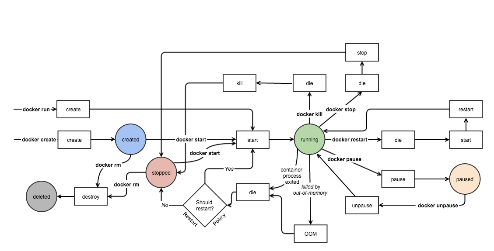

**Работа с Docker**

# Материалы
[Пример разворачивания сервера в контейнере Docker на Yandex Cloud](https://green-api.com/docs/sdk/python/pythonWebhookServer/serverDockerOnYandexCloud/)
[Полное практическое руководство по Docker: с нуля до кластера на AWS](https://habr.com/ru/articles/310460/)
[Docker Reference documentation](https://docs.docker.com/reference/)
[Работа с сетью (Networking) в Docker](https://linux-notes.org/rabota-s-setju-networking-v-docker/)
[Установка Docker на Debian/Ubuntu](http://linux-notes.org/ustanovka-docker-na-debian-ubuntu/)
[Установка Docker на CentOS/RedHat/Fedora](http://linux-notes.org/ustanovka-docker-na-centos-redhat-fedora/)
[Установка docker-compose в Unix/Linux](http://linux-notes.org/ustanovka-docker-compose-v-unix-linux/)
[Запуск docker контейнеров в Unix/Linux](http://linux-notes.org/zapusk-docker-kontejnerov-v-unix-linux/)
[Установка docker machine в Unix/Linux](http://linux-notes.org/ustanovka-docker-machine-v-unix-linux/)
[Настройка docker swarm кластера в Unix/Linux](http://linux-notes.org/nastrojka-docker-swarm-klastera-v-unix-linux/)
[Запуск GUI-приложения в Docker](http://linux-notes.org/zapusk-gui-prilozhenij-v-docker/)
[Запустить bash/SSH в контейнере с Docker](http://linux-notes.org/zapustit-bash-ssh-v-kontejnere-s-docker/)
[Создание base image для docker в Unix/Linux](http://linux-notes.org/sozdanie-base-image-dlya-docker-v-unix-linux/)
[Создание docker контейнера в Unix/Linux](http://linux-notes.org/sozdanie-docker-kontejnera-v-unix-linux/)
[Остановить/Удалить все Docker контейнеры/images](http://linux-notes.org/ustanovka-docker-na-debian-ubuntu/)
[Docker-compose в действии: от базовой сборки до оптимизации приложений](https://www.yourtodo.ru/posts/docker-compose-v-dejstvii-ot-bazovoj-sborki-do-optimizatsii-prilozhenij/)

# Процессы изменения статусов контейнера Docker

# Установка docker
    Linux
        curl -sSL https://get.docker.com/ | sh
    Mac
        Скачайте dmg по этой ссылке:
        https://download.docker.com/mac/stable/Docker.dmg
    Windows
        Используйте MSI-инсталлятор:
        https://download.docker.com/win/stable/InstallDocker.msi

# Реестры и репозитории Docker
    Вход в реестр
        docker login
        docker login localhost:8080
    Выход из реестра
        docker logout
        docker logout localhost:8080
    Поиск образа
        docker search nginx
        docker search nginx -- filter stars=3 --no-trunc busybox
    Pull (выгрузка из реестра) образа
        docker pull nginx
        docker pull eon01/nginx localhost:5000/myadmin/nginx
    Push (загрузка в реестр) образа
        docker push eon01/nginx
        docker push eon01/nginx localhost:5000/myadmin/nginx
    
# Служба Docker
 ## Остановить службу Docker:
    Прежде чем мы сможем перезапустить демон Docker, нам нужно остановить службу Docker. Откройте окно терминала и выполните следующую команду:
     sudo service docker stop
 ## Проверьте состояние службы Docker:
    Чтобы убедиться, что служба Docker успешно остановлена, мы можем проверить ее состояние. Выполните следующую команду:
     sudo service docker status
    Если служба Docker остановлена, вы должны увидеть сообщение, указывающее, что служба не запущена.
 ## Перезапустите Docker Daemon:
    Теперь, когда служба Docker остановлена, пришло время перезапустить Docker daemon. Выполните следующую команду, чтобы запустить Docker daemon:
     sudo service docker start
    Теперь запустится демон Docker, инициализирующий все необходимые компоненты для правильной работы Docker.
 ## Проверьте состояние демона Docker:
    Чтобы подтвердить, что демон Docker успешно перезапущен, вы можете проверить его состояние. Выполните следующую команду:
      sudo service docker status
    Если демон Docker успешно запущен, вы должны увидеть сообщение, указывающее на то, что служба Docker запущена.
 ## Протестируйте функциональность Docker:
    После перезапуска демона Docker рекомендуется протестировать функциональность Docker, чтобы убедиться, что все работает должным образом. Вы можете сделать это, выполнив простую команду Docker, например:
    docker version
    Если команда выполняется успешно и отображается информация о версии Docker, это означает, что Docker теперь функционирует должным образом.

# Первые действия с контейнерами
    Создание контейнера
        docker create -t -i eon01/infinite --name infinite
    Первый запуск контейнера
        docker run -it --name infinite -d eon01/infinite
    Переименование контейнера
        docker rename infinite infinity
    Удаление контейнера
        docker rm infinite
    Обновление контейнера
        docker update --cpu-shares 512 -m 300M infinite

# Запуск и остановка контейнеров
    Запуск остановленного контейнера
        docker start nginx
            Запуск контейнера всегда стартует его в фоновом режиме, поэтому вы не увидите лога. Чтобы его посмотреть, воспользуйтесь командой docker logs nginx.
    Остановка
        docker stop nginx
    Перезагрузка
        docker restart nginx
    Пауза (приостановка всех процессов контейнера)
        docker pause nginx
    Снятие паузы
        docker unpause nginx
    Блокировка (до остановки контейнера)
        docker wait nginx
    Отправка SIGKILL (завершающего сигнала)
        docker kill nginx
            ocker stop шлет сигнал SIGTERM, который должен обработать приложение внутри контейнера и остановиться. Если оно настроено неправильно, то этого не произойдет и команда docker stop не сможет остановить контейнер. В этом случае понадобится docker kill. Эта команда использует сигнал SIGKILL, который гарантировано останавливает контейнер.
    Отправка другого сигнала
        docker kill -s HUP nginx
    Подключение к существующему контейнеру
        docker attach nginx

docker kill
d

# Получение информации о контейнерах
    Работающие контейнеры
        docker ps
    Работающие и не работаюие контейнеры
        docker ps -a 
    Логи контейнера
        docker logs infinite
    Информация о контейнере
        docker inspect infinite
        docker inspect --format '{{ .NetworkSettings.IPAddress }}' $(docker ps -q)
    События контейнера
        docker events infinite
    Публичные порты
        docker port infinite
    Выполняющиеся процессы
        docker top infinite

        docker ps
            Теперь выведем информацию о запущенных контейнерах командой docker ps:

            CONTAINER ID        IMAGE                            COMMAND                  CREATED             STATUS              PORTS                                          NAMES
            431a3b3fc24b        nginx                            "nginx -g 'daemon of…"   2 minutes ago       Up 2 minutes        80/tcp                                         nginx
            Расшифровка столбиков:

            CONTAINER_ID — идентификатор контейнера. Так же, как и в git, используется сокращенная запись хеша
            IMAGE — имя образа, из которого был поднят контейнер. Если не указан тег, то подразумевается latest
            COMMAND — команда, которая выполнилась на самом деле при старте контейнера
            CREATED — время создания контейнера
            STATUS — текущее состояние
            PORTS — проброс портов
            NAMES — алиас. Docker позволяет кроме идентификатора иметь имя. Так гораздо проще обращаться с контейнером. Если при создании контейнера имя не указано, то Docker самостоятельно его придумывает. В выводе выше как раз такое имя у nginx
            Команда docker ps выводит только запущенные контейнеры. Но кроме них могут быть и остановленные. Причем остановка может происходить как по успешному завершению, так и в случае ошибок. Попробуйте набрать docker run ubuntu ls, а затем docker run ubuntu bash -c "unknown". Эти команды не запускают долгоживущий процесс, они завершаются сразу после выполнения, причем вторая с ошибкой, так как такой команды не существует.

            Теперь выведем все контейнеры командой docker ps -a. Первыми тремя строчками вывода окажутся:

            docker ps -a

            CONTAINER ID        IMAGE                            COMMAND                  CREATED                  STATUS                       PORTS                                          NAMES
            85fb81250406        ubuntu                           "bash -c unkown"         Less than a second ago   Exited (127) 3 seconds ago                                                  loving_bose
            c379040bce42        ubuntu                           "ls"                     Less than a second ago   Exited (0) 9 seconds ago                                                    determined_tereshkova
            Здесь как раз два последних запуска. Если посмотреть на колонку STATUS, то видно, что оба контейнера находятся в состоянии Exited. То есть запущенная команда внутри них выполнилась, и они остановились. Разница лишь в том, что один завершился успешно (0), а второй с ошибкой (127).
# Подключение к контейнеру
    docker exec -ti NAME_OF_CONTAINER psql -U YOUR_POSTGRES_USERNAME
      -i – интерактивный режим, не закрываем STDIN при старте.
      -t – запуск псевдо-терменала.
    Важно:
          docker exec запускает команду psql в запущеном контейнере.
          docker run запустит новый контейнер.
    Узнать имя контейнера можно с помощью
        docker ps -a 
        ключ -a покажет нам все контейнеры, в том числе погашенные.
    Посмотреть логи контейнера
        docker logs {{ container name }}

# Использование ресурсов
    docker stats infinite

# Изменения в файлах или директориях файловой системы контейнера
    docker diff infinite

# Управление образами
    Список образов
        docker images
    Создание образов
        docker build .
        docker build github.com/creack/docker-firefox
        docker build - < Dockerfile
        docker build - < context.tar.gz
        docker build -t eon/infinite .
        docker build -f myOtherDockerfile .
        curl example.com/remote/Dockerfile | docker build -f - .
    Удаление образа
        docker rmi nginx
    Загрузка репозитория в tar (из файла или стандартного ввода)
        docker load < ubuntu.tar.gz
        docker load --input ubuntu.tar
    Сохранение образа в tar-архив
        docker save busybox > ubuntu.tar
    Просмотр истории образа
        docker history
    Создание образа из контейнера
        docker commit nginx
    Тегирование образа
        docker tag nginx eon01/nginx
    Push (загрузка в реестр) образа
        docker push eon01/nginx

# Сеть
    Создание сети
          docker network create -d overlay MyOverlayNetwork
          docker network create -d bridge MyBridgeNetwork
          docker network create -d overlay \
          --subnet=192.168.0.0/16 \
          --subnet=192.170.0.0/16 \
          --gateway=192.168.0.100 \
          --gateway=192.170.0.100 \
          --ip-range=192.168.1.0/24 \
          --aux-address="my-router=192.168.1.5" --aux-address="my-switch=192.168.1.6" \
          --aux-address="my-printer=192.170.1.5" --aux-address="my-nas=192.170.1.6" \
          MyOverlayNetwork
    Удаление сети
          docker network rm MyOverlayNetwork
    Список сетей
          docker network ls
    Получение информации о сети
          docker network inspect MyOverlayNetwork
    Подключение работающего контейнера к сети
          docker network connect MyOverlayNetwork nginx
    Подключение контейнера к сети при его запуске
          docker run -it -d --network=MyOverlayNetwork nginx
    Отключение контейнера от сети
          docker network disconnect MyOverlayNetwork nginx
    Посмотреть в каких сетях подключен контейнер с1
          docker inspect c1 -f "{{json .NetworkSettings.Networks }}"
    Посмотреть контейнеры в сети
          docker network inspect MyOverlayNetwork -f "{{json .Containers }}"

# Очистка Docker
    Удаление работающего контейнера
          docker rm nginx
    Удаление контейнера и его тома (volume)
          docker rm -v nginx
    Удаление всех контейнеров со статусом exited
          docker rm $(docker ps -a -f status=exited -q)
    удаление всех остановленных контейнеров
        docker container prune
        docker rm `docker ps -a -q`
    удаление контейнеров, остановленных более суток назад
        docker container prune --filter "until=24h"
    удаление образа
        docker rmi nginx
    удаление неиспользуемых (dangling) образов
        docker image prune
        docker rmi $(docker images -f dangling=true -q)
    удаление неиспользуемых (dangling) образов даже с тегами
        docker image prune -a
    удаление всех образов
        docker rmi $(docker images -a -q)
    удаление всех образов без тегов
        docker rmi -f $(docker images | grep "^<none>" | awk "{print $3}")
    остановка и удаление всех контейнеров
        docker stop $(docker ps -a -q) && docker rm $(docker ps -a -q)
    удаление неиспользуемых (dangling) томов
        docker volume prune
        docker volume rm $(docker volume ls -f dangling=true -q)
    удаление неиспользуемых (dangling) томов по фильтру
        docker volume prune --filter "label!=keep"
    удаление неиспользуемых сетей
        docker network prune
    удаление всех неиспользуемых объектов
        docker system prune
    по умолчанию для Docker 17.06.1+ тома не удаляются. Чтобы удалились и они тоже:
        docker system prune --volumes
    удалить лишние контейнеры, образы, сети и томы:
        docker <system|container|image|volume|network> prune

# Docker Swarm
    Установка Docker Swarm
        curl -ssl https://get.docker.com | bash
        Прим. перев.: в Docker версий 1.12.0+ ничего дополнительно устанавливать не требуется, т.к. Docker Swarm встроен в Docker Engine в виде специального режима (Swarm mode).
    Инициализация Swarm
        docker swarm init --advertise-addr 192.168.10.1
    Подключение рабочего узла (worker) к Swarm
        docker swarm join-token worker
    Подключение управляющего узла (manager) к Swarm
        docker swarm join-token manager
    Список сервисов
        docker service ls
    Список узлов
        docker node ls
    Создание сервиса
        docker service create --name vote -p 8080:80 instavote/vote
    Список заданий Swarm
        docker service ps
    Масштабирование сервиса
        docker service scale vote=3
    Обновление сервиса
        docker service update --image instavote/vote:movies vote
        docker service update --force --update-parallelism 1 --update-delay 30s nginx
        docker service update --update-parallelism 5--update-delay 2s --image instavote/vote:indent vote
        docker service update --limit-cpu 2 nginx
        docker service update --replicas=5 nginx