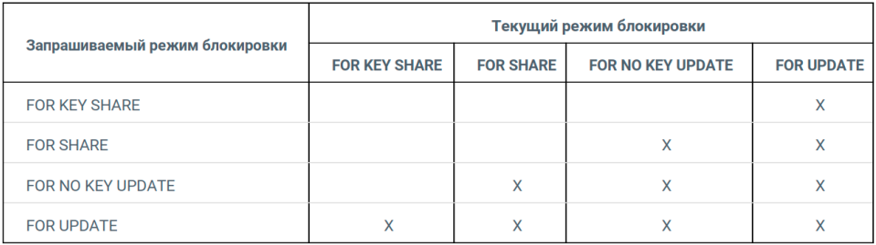

[Locks in PostgreSQL: 3. Other locks](https://postgrespro.com/blog/pgsql/5968020)
[13.3. Explicit Locking](https://www.postgresql.org/docs/15/explicit-locking.html)
[13.3. Явные блокировки](https://postgrespro.ru/docs/postgresql/13/explicit-locking)

# Блокировки объектов
    Проблема - как одновременно получить доступ к одному объекту?
    Решение - упорядочение конкурентного доступа к разделяемым ресурсам
        • перед обращением к данным процесс захватывает блокировку
        • после обращения — освобождает, другой процесс начинает ожидать освобождения ресурса
        • блокировки приводят к очередям
    Дальнейшее развитие
        • многоверсионность — несколько версий данных, не избавляет от всех проблем
        • оптимистичные блокировки — процессы не блокируются, но могут возникать ошибки
    Что подразумевается под ресурсом?
        • все, что можно идентифицировать
        Примеры ресурсов
            • реальные хранимые объекты: страницы, таблицы, строки и т. п.
            • структуры данных в общей памяти (хеш-таблицы, буферы...)
            • абстрактные ресурсы (число)
    Факторы, влияющие на производительность:
        Гранулярность блокировки
            • степень детализации, уровень в иерархии ресурсов, например:
            таблица → страница → строки, хеш-таблица → корзины
            • выше гранулярность — больше возможностей для параллелизма
        Режимы блокировок
            • совместимость режимов определяется матрицей
            • больше совместимых режимов — больше возможностей для параллелизма

    По типу:
        • исключительные (exclusive)
        • разделяемыми / совместные (shared)
    По времени жизни:
        Долговременные блокировки
            • обычно захватываются до конца транзакции и относятся к хранимым данным (например таблицы и отношения)
            • большое число режимов
            • развитая «тяжеловесная» инфраструктура, мониторинг
        Краткосрочные блокировки
            • обычно захватываются на доли секунды (управляются автоматически)
            • относятся к структурам в оперативной памяти
            • минимум режимов
            • «легковесная» инфраструктура, мониторинг может отсутствовать

    Типы ресурсов (столбец locktype в pg_locks):
        • Relation — Блокировки отношений
        • Transactionid — транзакция
        • Virtualxid — виртуальная транзакция
        • Tuple — версия строки
        • Extend — добавление страниц к файлу отношения
        • Object — не отношение: база данных, схема и т. п.
        • Page — страница (используется некоторыми типами индексов)
        • Advisory — рекомендательная блокировка

    Информация в общей памяти сервера - представление pg_locks:
        • locktype — тип блокируемого ресурса,
        • mode — режим блокировки
    Инфраструктура
        • очередь ожидания: ждущие процессы не потребляют ресурсы
        • обнаружение взаимоблокировок
    Ограниченное количество
        max_locks_per_transaction × max_connections
        при этом 1 транзакция может превысить max_locks_per_transaction

    Текущие блокировки
        • представление select * from pg_locks;
        • функция select pg_blocking_pids(pid);
    Вывод сообщений в журнал сервера
        • параметр SHOW log_lock_waits;
        • выводить сообщение об ожидании дольше deadlock_timeout или log_min_duration_statement
    Максимальное время ожидания блокировки
        • lock_timeout

# Блокировки объектов: предикатные блокировки
    Задача: реализация уровня изоляции Serializable
        • используются в дополнение к обычной изоляции на снимках данных
        • оптимистичные блокировки, название сложилось исторически
    Информация в общей памяти сервера
        • представление pg_locks со специальным режимом SIReadLock
    Ограниченное количество
        • max_pred_locks_per_transaction × max_connections
    Повышение количества блокировок (автоэкскалация)
        • max_pred_locks_per_relation
        • max_pred_locks_per_page

# Блокировки отношений
 ## Режимы

 ## Матрица

 ## Пример 

# Блокировки строк
    • информация только в страницах данных
    • поле xmax заголовка версии строки + информационные биты
    • неограниченное количество (могут быть миллиарды строк)
    • большое число минимально отражается на производительности
    • очередь ожидания организована с помощью блокировок объектов (пропорционально числу процессов, а не строк)

 ## Режимы: Исключительный и разделяемый
        Исключительный:
            UPDATE - удаление строки или изменение всех полей
            • SELECT FOR UPDATE
            • UPDATE (с изменением ключевых полей)
            • DELETE
            NO KEY UPDATE - изменение любых полей, кроме ключевых
            • SELECT FOR NO KEY UPDATE
            • UPDATE (без изменения ключевых полей - все внешние ключи без изменений)

        Разделяемый:
            SHARE - запрет изменения любых полей строки
            • SELECT FOR SHARE
            KEY SHARE - запрет изменения ключевых полей строки
            • SELECT FOR KEY SHARE
            • UPDATE (без изменения ключевых полей)

        Матрица исключительных и разделяемых блокировок строк

        • исключительные режимы конфликтуют между собой;
        • разделяемые режимы совместимы между собой;
        • разделяемый режим FOR KEY SHARE совместим с исключительным режимом FOR NO
        KEY UPDATE (то есть можно одновременно обновлять неключевые поля и быть
        уверенным в том, что ключ не изменится).

# Блокировки в памяти

  ## Spin блокировки, Spinlock
        • устанавливаются на очень короткое время, несколько инструкций процессора
        • используются атомарные инструкции процессора
        • единственный режим — исключительный
        • нет возможности мониторинга
        • нет обнаружения взаимоблокировок
        • цикл активного ожидания

  ## Легкие блокировки, LightWeightLock
        • устанавливаются на короткое время, обычно доли секунды
        • исключительный и разделяемый режимы
        • есть мониторинг
        • нет обнаружения взаимоблокировок
        • пассивное ожидание
        • при освобождении ресурса возникает состояние гонки, выигрывает случайный процесс    

  ## Закрепление буфера, BufferPin
        • устанавливается на время работы с буфером, возможно длительное
        • исключительный и разделяемый режимы
        • есть мониторинг
        • есть обнаружение взаимоблокировок
        • пассивное ожидание, но обычно закрепленный буфер пропускается

  ## Мониторинг
    Когда процесс ожидает чего-либо, этот факт отражается в представлении pg_stat_activity:
        • wait_event_type — тип ожидания
        • wait_event — имя конкретного ожидания
        • информация может быть не полна
        • охвачены не все места в коде, в которых могут быть ожидания
        • информация только на текущий момент
        • единственный способ получить картину во времени — семплинг
        • достоверная картина только при большом числе измерений

  ## Вывод в файл медленных запросов
        log_min_duration_statement (integer) в миллисекундах