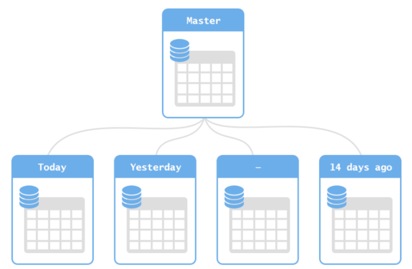
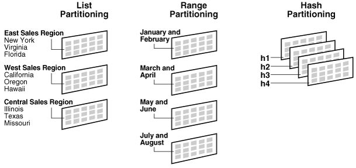
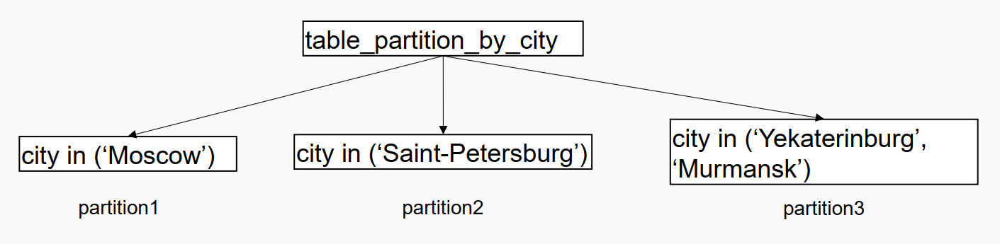
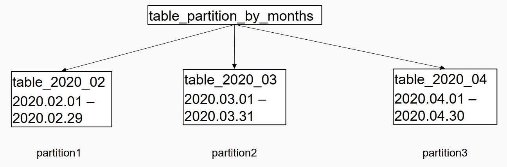
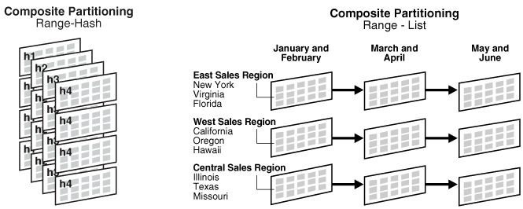

**Секционирование**
  
  
# Материалы:
   [Партиционирование в PostgreSQL – Что? Зачем? Как?](https://habr.com/ru/articles/273933/)

   [Секционирование в PostgreSQL 10 и не только](https://habr.com/ru/companies/postgrespro/articles/353472/)

# О секционировании
    Партиционирование (partitioning) — это способ повышения производительности запросов за счет логического разбиения больших таблиц (например, таблиц фактов) на небольшие части, называемые партициями (partitions). Партиционирование позволяет оптимизаторам запросов сканировать ограниченное число строк в таблице (на основе условий предикатов) вместо чтения всего содержимого таблицы.
    • Секционирование = партиционирование
    • «Разделяй и властвуй»
    • Таблицы в таблице
    • У секций могут быть свои секции
    Общий синтаксис для секционирования таблицы:
        PARTITION BY { RANGE | LIST | HASH } ( { имя_столбца | ( выражение ) } [ COLLATE
        правило_сортировки ] )
        CREATE TABLE section_name PARTITION OF table_name FOR VALUES FROM ('2006-02-01') TO ('2006-03-01');
    Удаление партиции – DROP TABLE section_name

# Секционирование наследованием
    ● До версии 10 секционирование в PostgreSQL базировалось на механизме наследования таблиц, где
    дочерние таблицы создавались как наследники одной родительской.
    ● Запрос на чтение родительской таблицы включал данные не только из родительской, но и из дочерних
    таблиц, но последующие дополнения позволили делать выборочное чтение, когда ограничения
    целостности гарантировали, что данные не содержатся в дочерних таблицах.
    ● Запись происходит по-другому: вставка в родительскую таблицу не перенаправляется автоматически в
    соответствующие дочерние таблицы, требуется добавление триггера для перенаправления данных.
    ● Управлять секциями требует большой работы при создании, и необходимо гарантировать корректное
    создание секций с самого начала для корректной работы триггеров вставки.
    ● В целом, этот механизм может быть интересным в специфических случаях, но может создать
    проблемы, особенно в производительности, и в большинстве других случаев лучше обойтись без такого
    секционирования.
   [5.10.3. Реализация с использованием наследования](https://postgrespro.ru/docs/postgresql/10/ddl-partitioning#DDL-PARTITIONING-IMPLEMENTATION-INHERITANCE)

## Примеры наследования
    ● Создается таблица и от неё наследуются секции с помощью команды:
        CREATE TABLE table_s1 () INHERITS (table);
    ● В дочерних таблицах создаются ограничения, которые не пересекаются между секциями:
        CHECK (date between…)
    ● Создается триггер, который распределяет строчки:
        CREATE TRIGGER trigger_name
        BEFORE INSERT ON table_name
        FOR EACH ROW EXECUTE PROCEDURE func_name();

# Inheritance & Declaration. Декларативное секционирование
    ● В версии 10 появилась новая система секционирования, основанная на инфраструктуре, уже существовавшей в PostgreSQL. Целью разработчиков было упрощение создания и администрирования секционированных таблиц. К уже существующим SQL-операторам (например CREATE TABLE и ALTER TABLE) добавлены специальные предложения для создания, присоединения/отсоединения секций. Вот список
    изменений:
      ○ Создание и администрирование секций упростилось благодаря интеграции в ядро СУБД.
      ○ Теперь триггеры больше не нужны. Вставка ускорилась, появилось автоматическое перенаправление вставляемых данных в правильную секцию, и генерируется ошибка в случае направления в неподходящую секцию.
      ○ При работе с секциями можно присоединять/отсоединять секции, есть явные ограничения целостности секций, возможно секционирование по выражению в ключе разбиения, и можно создавать подсекции.
      ○ Изменения в системном каталоге: новые столбцы в pg_class и новый каталог pg_partitioned_table.
    ● В упрощении создания секций легко убедиться: больше нет необходимости создавать специальные функции-триггеры для управления вставками и обновлениями. Данные теперь маршрутизируются автоматически функциями, создаваемыми при определении секции. В случае, когда для вводимых данных не находится подходящей секции, просто генерируется ошибка. Такая автоматическая маршрутизация не только удобна, она и ускоряет вставку.
    ● Каталог pg_class был модифицирован и теперь содержит информацию о том, является ли таблица секцией (если да, то: relispartition = 't'), секционирована ли таблица (если да, то: relkind = 'p') или это обычная таблица (relkind = 't'), и внутреннее представление границ секций(relpartbound).
   [5.10.2. Декларативное секционирование](https://postgrespro.ru/docs/postgresql/10/ddl-partitioning#DDL-PARTITIONING-DECLARATIVE)

   [Виды секционирования](https://habr.com/ru/companies/postgrespro/articles/353472/)

## Примеры декларативного секционирования
    ● Можно создавать дефолтную секцию:
        create table part_name partition of main_table default;
    ● Можно использовать минимальное, максимальное значение для range partition
        create table part_name partition of main_table for values from (MINVALUE) to (MAXVALUE);
    ● Можно отсоединять секции:
        alter table main_table detach partition part_name;
    ● Можно добавлять секции:
        alter table main_table attach partition part_name for values from (‘2020-01-01’) to
    (‘2020-02-01’);
    ● Не забыть включить 
        enable_partition_pruning для оптимизации (default on).

    Трудности:
    ● В partition by range не получится использовать в ключе секционирования null значения;
    ● Не умеет создавать секции самостоятельно (можно использовать cron и прочее);
    ● Не получится создать уникальное ограничение на часть.

# Виды секционирования
   Существует три вида секционирования:
   * По списку
   * По диапазону
   * По хэшу
   
    Общий синтаксис для секционирования таблицы:
      PARTITION BY { RANGE | LIST | HASH } ( { имя_столбца | ( выражение ) } [ COLLATE правило_сортировки ] [ класс_операторов ] [, ... ] )
      CREATE TABLE section_name PARTITION OF table_name FOR VALUES FROM ('2006-02-01') TO ('2006-03-01');
      [CREATE TABLE](https://postgrespro.ru/docs/postgresql/10/sql-createtable)
    Удаление партиции:
      DROP TABLE section_name
    
## По списку
   
   CREATE TABLE city_moscow PARTITION OF city FOR VALUES IN (‘Moscow');

## По диапазону
   
   CREATE TABLE table_2020_02 PARTITION OF table FOR VALUES FROM (‘2020-02-01’) TO (‘2020-03-01’)

## По хэшу:
    * Когда необходимо равномерное распределение
    * Нет явного ключа, по которому можно разбить таблицу
    * Для равномерного распределения необходимо уникальное или почти уникальное поле
    
    CREATE TABLE table_p1 PARTITION OF table FOR VALUES WITH (MODULUS 5, REMAINDER 0);

## Комбинирование (subpartition):
   
   [Oracle. Partitioned Tables and Indexes](https://docs.oracle.com/cd/B10500_01/server.920/a96524/c12parti.htm)

# pg_pathman:
  Это расширение Postgres Pro, реализующее оптимизированное решение для секционирования больших и распределённых баз данных. Используя pg_pathman, вы можете:
  * Секционировать большие базы данных, не прерывая их работу.
  * Ускорять выполнение запросов с секционированными таблицами.
  * Управлять существующими и добавлять новые секции на лету.
  * Добавлять в качестве секций сторонние таблицы.
  * Соединять секционированные таблицы для операций чтения и записи.
  * Это расширение совместимо с Postgres Pro 9.5 и новее.

   ● Доступно разбиение по хэшу и диапазонам Автоматическое создание секций при секционировании по диапазонам;
   ● Можно соединять или разделять секции;
   ● Не факт, что будут развивать в 14 версии (хотя тоже самое говорили про 13).

   [F.35. pg_pathman](https://postgrespro.ru/docs/postgrespro/13/pg-pathman)
   
   [postgrespro/pg_pathman GitHub](https://github.com/postgrespro/pg_pathman)
   
   [The initial use pg_pathman](https://www.programmersought.com/article/25792165890/)