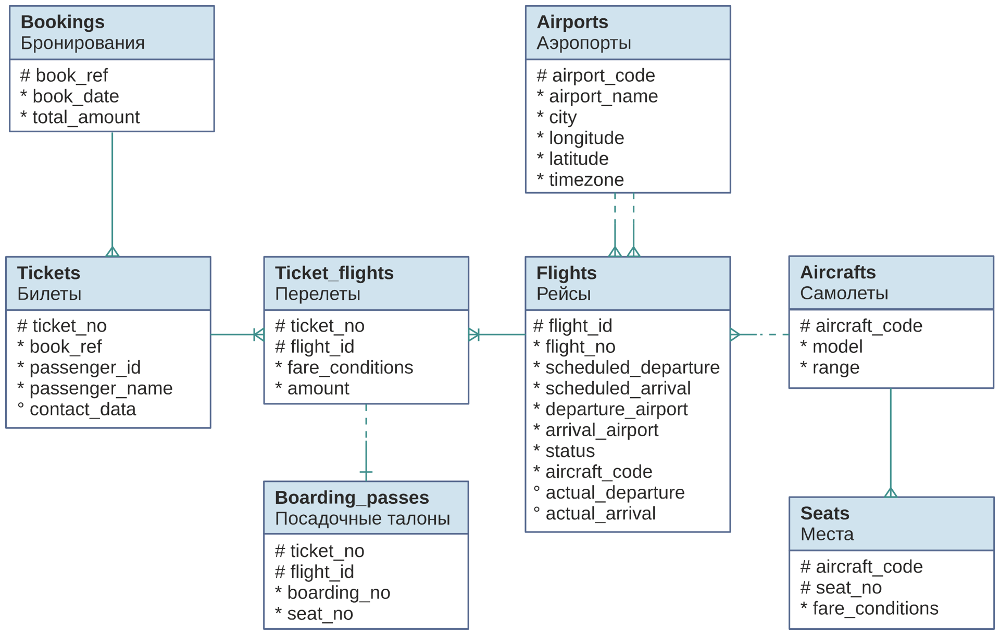

# Материалы по БД bookings
[Приложение K. Демонстрационная база данных «Авиаперевозки»](https://postgrespro.ru/docs/postgrespro/16/demodb-bookings)
[K.1. Установка](https://postgrespro.ru/docs/postgrespro/16/demodb-bookings-installation)
[K.2. Диаграмма схемы данных](\Booking_ER_diargam.png)
[K.3. Описание схемы](https://postgrespro.ru/docs/postgrespro/16/demodb-schema-description)
[K.4. Объекты схемы](https://postgrespro.ru/docs/postgrespro/16/demodb-schema-objects)
[K.5. Использование](https://postgrespro.ru/docs/postgrespro/16/demodb-usage)

# K.2. Диаграмма схемы данных

# K.4. Объекты схемы #
K.4.1. Список отношений
K.4.2. Представление bookings.aircrafts
K.4.3. Таблица bookings.aircrafts_data
K.4.4. Представление bookings.airports
K.4.5. Таблица bookings.airports_data
K.4.6. Таблица bookings.boarding_passes
K.4.7. Таблица bookings.bookings
K.4.8. Таблица bookings.flights
K.4.9. Таблица bookings.seats
K.4.10. Таблица bookings.ticket_flights
K.4.11. Таблица bookings.tickets
K.4.12. Представление bookings.flights_v
K.4.13. Представление bookings.routes
K.4.14. Функция bookings.now
K.4.15. Функция bookings.lang

# K.4.1. Список отношений #
       Имя       |     Тип       |  Small | Medium |   Big  |       Описание
-----------------+---------------+--------+--------+--------+-------------------------
 aircrafts       | представление |        |        |        | Самолеты
 aircrafts_data  | таблица       |  16 kB |  16 kB |  16 kB | Самолеты (переводы)
 airports        | представление |        |        |        | Аэропорты
 airports_data   | таблица       |  56 kB |  56 kB |  56 kB | Аэропорты (переводы)
 boarding_passes | таблица       |  31 MB | 102 MB | 427 MB | Посадочные талоны
 bookings        | таблица       |  13 MB |  30 MB | 105 MB | Бронирования
 flights         | таблица       |   3 MB |   6 MB |  19 MB | Рейсы
 flights_v       | представление |        |        |        | Рейсы
 routes          | представление |        |        |        | Маршруты
 seats           | таблица       |  88 kB |  88 kB |  88 kB | Места
 ticket_flights  | таблица       |  64 MB | 145 MB | 516 MB | Перелеты
 tickets         | таблица       |  47 MB | 107 MB | 381 MB | Билеты
    
# K.4.2. Представление bookings.aircrafts #
Каждая модель воздушного судна идентифицируется своим трёхзначным кодом (aircraft_code). Указывается также название модели (model) и максимальная дальность полета в километрах (range).

Значение поля model определяется в зависимости от выбранного языка. За подробностями обратитесь к Подразделу K.4.15.

    Столбец    |   Тип   | Модификаторы |             Описание
---------------+---------+--------------+-----------------------------------
 aircraft_code | char(3) | not null     | Код самолета, IATA
 model         | text    | not null     | Модель самолета
 range         | integer | not null     | Максимальная дальность полета, км
Определение представления:
 SELECT ml.aircraft_code,
    ml.model ->> lang() AS model,
    ml.range
   FROM aircrafts_data ml;
    
# K.4.3. Таблица bookings.aircrafts_data #
Это базовая таблица для представления aircrafts. Поле model этой таблицы содержит переводы моделей самолётов на разные языки, в формате JSONB. В большинстве случаев к этой таблице не следует обращаться напрямую.

    Столбец    |   Тип   | Модификаторы |             Описание
---------------+---------+--------------+-----------------------------------
 aircraft_code | char(3) | not null     | Код самолета, IATA
 model         | jsonb   | not null     | Модель самолета
 range         | integer | not null     | Максимальная дальность полета, км
Индексы:
    PRIMARY KEY, btree (aircraft_code)
Ограничения-проверки:
    CHECK (range > 0)
Ссылки извне:
    TABLE "flights" FOREIGN KEY (aircraft_code)
        REFERENCES aircrafts_data(aircraft_code)
    TABLE "seats" FOREIGN KEY (aircraft_code)
        REFERENCES aircrafts_data(aircraft_code) ON DELETE CASCADE
    
# K.4.4. Представление bookings.airports #
Аэропорт идентифицируется трехбуквенным кодом (airport_code) и имеет своё имя (airport_name).

Для города не предусмотрено отдельной сущности, но введено поле с названием города (city), позволяющее найти аэропорты одного города. Это представление также включает координаты аэропорта (coordinates) и часовой пояс (timezone).

Значения полей airport_name и city определяются в зависимости от выбранного языка. За подробностями обратитесь к Подразделу K.4.15.

   Столбец    |   Тип   | Модификаторы |                 Описание
--------------+---------+--------------+--------------------------------------------
 airport_code | char(3) | not null     | Код аэропорта
 airport_name | text    | not null     | Название аэропорта
 city         | text    | not null     | Город
 coordinates  | point   | not null     | Координаты аэропорта (долгота и широта)
 timezone     | text    | not null     | Часовой пояс аэропорта
Определение представления:
 SELECT ml.airport_code,
    ml.airport_name ->> lang() AS airport_name,
    ml.city ->> lang() AS city,
    ml.coordinates,
    ml.timezone
   FROM airports_data ml;
    
# K.4.5. Таблица bookings.airports_data #
Это базовая таблица для представления airports. Она содержит переводы значений airport_name и city на разные языки, в формате JSONB. В большинстве случаев к этой таблице не следует обращаться напрямую.

   Столбец    |   Тип   | Модификаторы |                 Описание
--------------+---------+--------------+--------------------------------------------
 airport_code | char(3) | not null     | Код аэропорта
 airport_name | jsonb   | not null     | Название аэропорта
 city         | jsonb   | not null     | Город
 coordinates  | point   | not null     | Координаты аэропорта (долгота и широта)
 timezone     | text    | not null     | Часовой пояс аэропорта
Индексы:
    PRIMARY KEY, btree (airport_code)
Ссылки извне:
    TABLE "flights" FOREIGN KEY (arrival_airport)
        REFERENCES airports_data(airport_code)
    TABLE "flights" FOREIGN KEY (departure_airport)
        REFERENCES airports_data(airport_code)
    
# K.4.6. Таблица bookings.boarding_passes #
При регистрации на рейс, которая возможна за сутки до плановой даты отправления, пассажиру выдаётся посадочный талон. Он идентифицируется также, как и перелёт — номером билета и номером рейса.

Посадочным талонам присваиваются последовательные номера (boarding_no) в порядке регистрации пассажиров на рейс (этот номер будет уникальным только в пределах данного рейса). В посадочном талоне указывается номер места (seat_no).

   Столбец   |    Тип     | Модификаторы |         Описание
-------------+------------+--------------+--------------------------
 ticket_no   | char(13)   | not null     | Номер билета
 flight_id   | integer    | not null     | Идентификатор рейса
 boarding_no | integer    | not null     | Номер посадочного талона
 seat_no     | varchar(4) | not null     | Номер места
Индексы:
    PRIMARY KEY, btree (ticket_no, flight_id)
    UNIQUE CONSTRAINT, btree (flight_id, boarding_no)
    UNIQUE CONSTRAINT, btree (flight_id, seat_no)
Ограничения внешнего ключа:
    FOREIGN KEY (ticket_no, flight_id)
        REFERENCES ticket_flights(ticket_no, flight_id)
    
# K.4.7. Таблица bookings.bookings #
Пассажир заранее (book_date, максимум за месяц до рейса) бронирует билет себе и, возможно, нескольким другим пассажирам. Бронирование идентифицируется номером (book_ref, шестизначная комбинация букв и цифр).

Поле total_amount хранит общую стоимость включённых в бронирование перелетов всех пассажиров.

   Столбец    |      Тип      | Модификаторы |         Описание
--------------+---------------+--------------+---------------------------
 book_ref     | char(6)       | not null     | Номер бронирования
 book_date    | timestamptz   | not null     | Дата бронирования
 total_amount | numeric(10,2) | not null     | Полная сумма бронирования
Индексы:
    PRIMARY KEY, btree (book_ref)
Ссылки извне:
    TABLE "tickets" FOREIGN KEY (book_ref) REFERENCES bookings(book_ref)
    
# K.4.8. Таблица bookings.flights #
Естественный ключ таблицы рейсов состоит из двух полей — номера рейса (flight_no) и даты отправления (scheduled_departure). Чтобы сделать внешние ключи на эту таблицу компактнее, в качестве первичного используется суррогатный ключ (flight_id).

Рейс всегда соединяет две точки — аэропорты вылета (departure_airport) и прибытия (arrival_airport). Такое понятие, как «рейс с пересадками» отсутствует: если из одного аэропорта до другого нет прямого рейса, в билет просто включаются несколько необходимых рейсов.

У каждого рейса есть запланированные дата и время вылета (scheduled_departure) и прибытия (scheduled_arrival). Реальные время вылета (actual_departure) и прибытия (actual_arrival) могут отличаться: обычно не сильно, но иногда и на несколько часов, если рейс задержан.

Статус рейса (status) может принимать одно из следующих значений:

Scheduled
Рейс доступен для бронирования. Это происходит за месяц до плановой даты вылета; до этого запись о рейсе не существует в базе данных.

On Time
Рейс доступен для регистрации (за сутки до плановой даты вылета) и не задержан.

Delayed
Рейс доступен для регистрации (за сутки до плановой даты вылета), но задержан.

Departed
Самолет уже вылетел и находится в воздухе.

Arrived
Самолет прибыл в пункт назначения.

Cancelled
Рейс отменён.

       Столбец       |     Тип     | Модификаторы |          Описание
---------------------+-------------+--------------+-----------------------------
 flight_id           | serial      | not null     | Идентификатор рейса
 flight_no           | char(6)     | not null     | Номер рейса
 scheduled_departure | timestamptz | not null     | Время вылета по расписанию
 scheduled_arrival   | timestamptz | not null     | Время прилёта по расписанию
 departure_airport   | char(3)     | not null     | Аэропорт отправления
 arrival_airport     | char(3)     | not null     | Аэропорт прибытия
 status              | varchar(20) | not null     | Статус рейса
 aircraft_code       | char(3)     | not null     | Код самолета, IATA
 actual_departure    | timestamptz |              | Фактическое время вылета
 actual_arrival      | timestamptz |              | Фактическое время прилёта
Индексы:
    PRIMARY KEY, btree (flight_id)
    UNIQUE CONSTRAINT, btree (flight_no, scheduled_departure)
Ограничения-проверки:
    CHECK (scheduled_arrival > scheduled_departure)
    CHECK ((actual_arrival IS NULL)
       OR  ((actual_departure IS NOT NULL AND actual_arrival IS NOT NULL)
            AND (actual_arrival > actual_departure)))
    CHECK (status IN ('On Time', 'Delayed', 'Departed',
                      'Arrived', 'Scheduled', 'Cancelled'))
Ограничения внешнего ключа:
    FOREIGN KEY (aircraft_code)
        REFERENCES aircrafts(aircraft_code)
    FOREIGN KEY (arrival_airport)
        REFERENCES airports(airport_code)
    FOREIGN KEY (departure_airport)
        REFERENCES airports(airport_code)
Ссылки извне:
    TABLE "ticket_flights" FOREIGN KEY (flight_id)
        REFERENCES flights(flight_id)
    
# K.4.9. Таблица bookings.seats #
Места определяют схему салона каждой модели. Каждое место определяется своим номером (seat_no) и имеет закреплённый за ним класс обслуживания (fare_conditions) — Economy, Comfort или Business.

     Столбец     |     Тип     | Модификаторы |      Описание
-----------------+-------------+--------------+--------------------
 aircraft_code   | char(3)     | not null     | Код самолета, IATA
 seat_no         | varchar(4)  | not null     | Номер места
 fare_conditions | varchar(10) | not null     | Класс обслуживания
Индексы:
    PRIMARY KEY, btree (aircraft_code, seat_no)
Ограничения-проверки:
    CHECK (fare_conditions IN ('Economy', 'Comfort', 'Business'))
Ограничения внешнего ключа:
    FOREIGN KEY (aircraft_code)
        REFERENCES aircrafts(aircraft_code) ON DELETE CASCADE
    
# K.4.10. Таблица bookings.ticket_flights #
Перелёт соединяет билет с рейсом и идентифицируется их номерами.

Для каждого перелета указываются его стоимость (amount) и класс обслуживания (fare_conditions).

     Столбец     |     Тип       | Модификаторы |    Описание
-----------------+---------------+--------------+---------------------
 ticket_no       | char(13)      | not null     | Номер билета
 flight_id       | integer       | not null     | Идентификатор рейса
 fare_conditions | varchar(10)   | not null     | Класс обслуживания
 amount          | numeric(10,2) | not null     | Стоимость перелета
Индексы:
    PRIMARY KEY, btree (ticket_no, flight_id)
Ограничения-проверки:
    CHECK (amount >= 0)
    CHECK (fare_conditions IN ('Economy', 'Comfort', 'Business'))
Ограничения внешнего ключа:
    FOREIGN KEY (flight_id) REFERENCES flights(flight_id)
    FOREIGN KEY (ticket_no) REFERENCES tickets(ticket_no)
Ссылки извне:
    TABLE "boarding_passes" FOREIGN KEY (ticket_no, flight_id)
        REFERENCES ticket_flights(ticket_no, flight_id)
    
# K.4.11. Таблица bookings.tickets #
Билет имеет уникальный номер (ticket_no), состоящий из 13 цифр.

Билет содержит идентификатор пассажира (passenger_id) — номер документа, удостоверяющего личность, — его фамилию и имя (passenger_name) и контактную информацию (contact_data).

Ни идентификатор пассажира, ни имя не являются постоянными (можно поменять паспорт, можно сменить фамилию), поэтому однозначно найти все билеты одного и того же пассажира невозможно.

     Столбец    |     Тип     | Модификаторы |          Описание
----------------+-------------+--------------+-----------------------------
 ticket_no      | char(13)    | not null     | Номер билета
 book_ref       | char(6)     | not null     | Номер бронирования
 passenger_id   | varchar(20) | not null     | Идентификатор пассажира
 passenger_name | text        | not null     | Имя пассажира
 contact_data   | jsonb       |              | Контактные данные пассажира
Индексы:
    PRIMARY KEY, btree (ticket_no)
Ограничения внешнего ключа:
    FOREIGN KEY (book_ref) REFERENCES bookings(book_ref)
Ссылки извне:
    TABLE "ticket_flights" FOREIGN KEY (ticket_no) REFERENCES tickets(ticket_no)
     
# K.4.12. Представление bookings.flights_v #
Над таблицей flights создано представление flights_v, содержащее дополнительную информацию:

расшифровку данных об аэропорте вылета — departure_airport, departure_airport_name, departure_city

расшифровку данных об аэропорте прибытия — arrival_airport, arrival_airport_name, arrival_city

местное время вылета — scheduled_departure_local, actual_departure_local

местное время прибытия — scheduled_arrival_local, actual_arrival_local

продолжительность полета — scheduled_duration, actual_duration.

          Столбец          |     Тип     |              Описание
---------------------------+-------------+--------------------------------------
 flight_id                 | integer     | Идентификатор рейса
 flight_no                 | char(6)     | Номер рейса
 scheduled_departure       | timestamptz | Время вылета по расписанию
 scheduled_departure_local | timestamp   | Время вылета по расписанию,
                           |             | местное время в пункте отправления
 scheduled_arrival         | timestamptz | Время прилёта по расписанию
 scheduled_arrival_local   | timestamp   | Время прилёта по расписанию,
                           |             | местное время в пункте прибытия
 scheduled_duration        | interval    | Планируемая продолжительность полета
 departure_airport         | char(3)     | Код аэропорта отправления
 departure_airport_name    | text        | Название аэропорта отправления
 departure_city            | text        | Город отправления
 arrival_airport           | char(3)     | Код аэропорта прибытия
 arrival_airport_name      | text        | Название аэропорта прибытия
 arrival_city              | text        | Город прибытия
 status                    | varchar(20) | Статус рейса
 aircraft_code             | char(3)     | Код самолета, IATA
 actual_departure          | timestamptz | Фактическое время вылета
 actual_departure_local    | timestamp   | Фактическое время вылета,
                           |             | местное время в пункте отправления
 actual_arrival            | timestamptz | Фактическое время прилёта
 actual_arrival_local      | timestamp   | Фактическое время прилёта,
                           |             | местное время в пункте прибытия
 actual_duration           | interval    | Фактическая продолжительность полета
    
# K.4.13. Представление bookings.routes #
Таблица рейсов (bookings.flights) содержит избыточность: из неё можно было бы выделить информацию о маршруте (номер рейса, аэропорты отправления и назначения), которая не зависит от конкретных дат рейсов.

Именно такая информация составляет представление routes.

        Столбец         |    Тип    |              Описание
------------------------+-----------+-------------------------------------
 flight_no              | char(6)   | Номер рейса
 departure_airport      | char(3)   | Код аэропорта отправления
 departure_airport_name | text      | Название аэропорта отправления
 departure_city         | text      | Город отправления
 arrival_airport        | char(3)   | Код аэропорта прибытия
 arrival_airport_name   | text      | Название аэропорта прибытия
 arrival_city           | text      | Город прибытия
 aircraft_code          | char(3)   | Код самолета, IATA
 duration               | interval  | Продолжительность полета
 days_of_week           | integer[] | Дни недели, когда выполняются рейсы
    
# K.4.14. Функция bookings.now #
Демонстрационная база содержит временной «срез» данных — так, как будто в некоторый момент была сделана резервная копия реальной системы. Например, если некоторый рейс имеет статус Departed, это означает, что в момент резервного копирования самолет вылетел и находился в воздухе.

Позиция «среза» сохранена в функции bookings.now() function. Ей можно пользоваться в запросах там, где в обычной жизни использовалась бы функция now().

Кроме того, значение этой функции определяет версию демонстрационной базы данных. Актуальная версия на текущий момент — от 15 августа 2017 г.

# K.4.15. Функция bookings.lang #
Некоторые поля в демонстрационной базе содержат текст на английском и русском языках. Переводы на другие языки отсутствуют, но их несложно добавить. Функция bookings.lang возвращает значение параметра bookings.lang, то есть язык, на котором будут выдаваться значения этих полей.

Эта функция используется в представлениях aircrafts и airports и не предназначена для непосредственного использования в запросах.